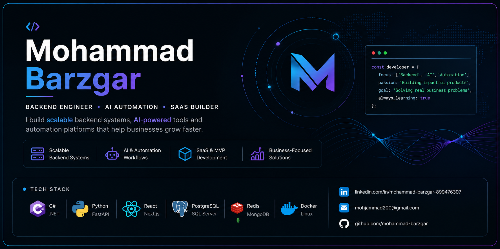

  

# Hi, I'm Mohammad Barzgar 👋

### Backend Engineer focused on AI, SaaS and Business Automation

I help startups and businesses build scalable backend systems, AI-powered workflows, and production-ready SaaS products.

---

## 🚀 What I Build

* 🤖 AI-powered business applications
* ⚙️ Workflow automation systems
* 🏗️ Scalable backend architectures
* 📊 CRM / ERP platforms
* 🌐 REST APIs & integrations
* 🚀 MVPs that can reach production quickly

---

## 💼 Experience

Over the past few years I've worked on business-critical software including:

### Enterprise ERP Platform

Designed and implemented a microservice-based ERP including:

* Inventory Management
* Accounting
* BPM Workflows
* Reporting
* Authentication
* API Gateway
* Event Bus
* Notification Service
* Distributed Caching

One of the most challenging problems was designing reliable inventory synchronization under heavy concurrent requests while preventing overselling and minimizing database locking.

---

### AI CRM Assistant

An AI-powered assistant for CRM platforms that helps sales teams automate repetitive tasks and improve customer interactions.

---

### Workflow Automation Platform

Built a production-ready automation platform using **n8n**, AI integrations and custom backend services.

Delivered the complete system—including backend, dashboards and landing page—in only **10 days**.

---

## 🛠 Tech Stack

### Backend

* ASP.NET Core
* C#
* Python
* FastAPI
* Django

### Frontend

* React
* Next.js
* JavaScript

### Databases

* PostgreSQL
* SQL Server
* MongoDB
* Redis

### DevOps

* Docker
* Linux
* Nginx

### AI & Automation

* OpenAI APIs
* AI Agents
* n8n
* AI Workflows
* LLM Integrations

---

## 🎯 What I'm Looking For

I'm interested in working with startups and companies building:

* SaaS products
* AI applications
* Automation platforms
* Business software
* Backend-heavy systems

Remote opportunities are especially welcome.

---

## 📫 Let's Connect

* LinkedIn: https://linkedin.com/in/mohammad-barzgar-899476307
* Email: [mohjammad200@gmail.com](mailto:mohjammad200@gmail.com)
